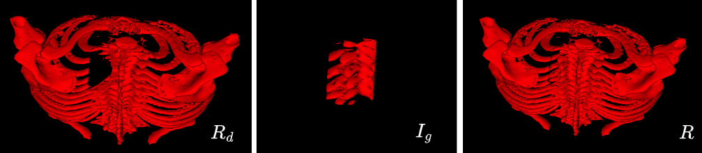
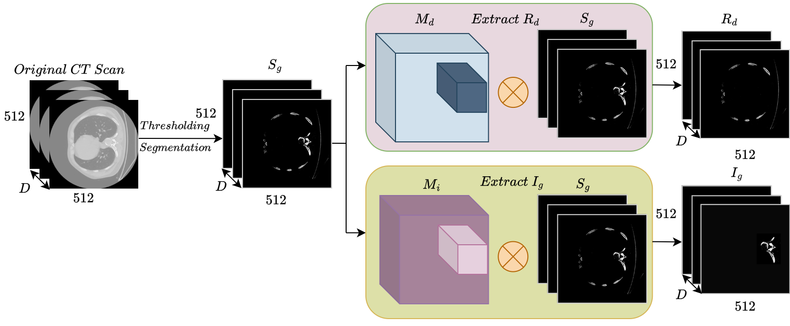
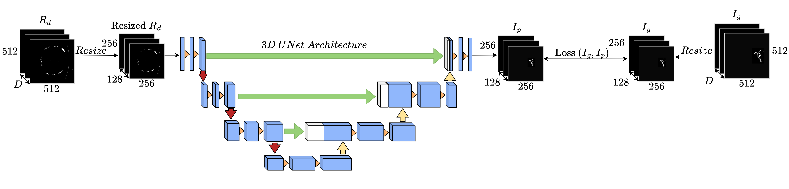
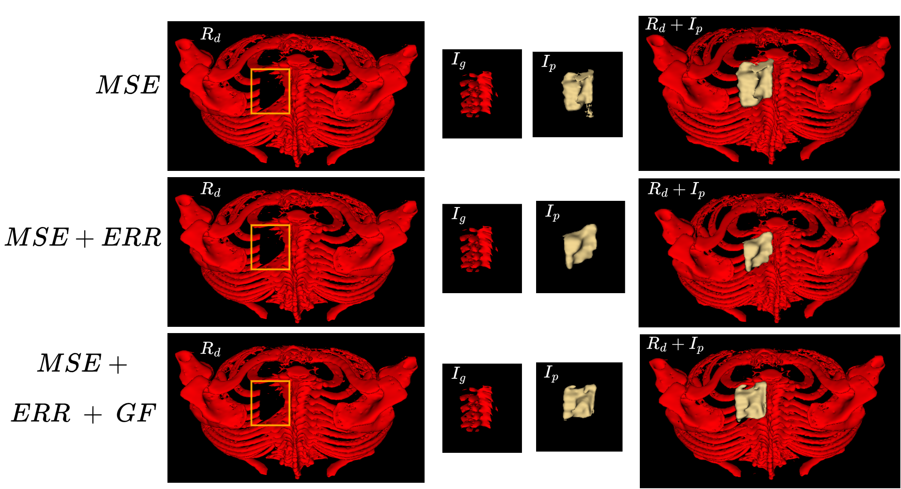
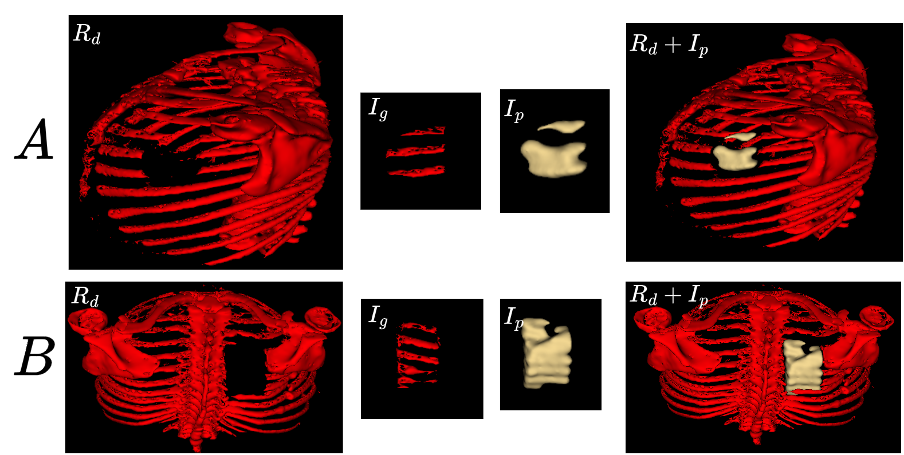

# RibCageImp: A Deep Learning Framework for 3D Ribcage Implant Generation


In this work, we explore the feasibility of automating ribcage implant generation using deep learning techniques. We present a framework based on the 3D U-Net architecture, which processes CT scans to generate patient-specific implant designs. To the best of our knowledge, this is the first investigation into the automated generation of thoracic implants using deep learning. While the preliminary results are moderate, they highlight both the potential and the significant challenges in this complex domain.



The above figure illustrates a ribcage defect, its original implant, and the complete ribcage.

## Dataset

The dataset used in this project is the **RibFrac Dataset**, which can be accessed here: [RibFrac Dataset](https://ribfrac.grand-challenge.org/dataset/). You can create your own dataset using the RibFrac dataset. If you prefer to work with the dataset I have created, feel free to reach out to me.

## Setup and Installation

To implement this code, you first need to set up a Python environment with PyTorch and the CUDA Toolkit. Then, install the required dependencies by running the following command:

```bash
!pip install -r requirements.txt
```

## Directory Structure

- The `src` folder contains all the code.
- The `AnalysisNotebooks` folder includes notebooks for data analysis.
- The `DatasetCreation` folder contains code for creating the dataset, from which defects and ground truth implants are generated.
- The `ModelTraining` folder contains code for training the models.
- The `ModelEvaluation` folder contains code for the model evlaution on test dataset on DICE, MSE and HD metrics.


### Data Preparation

The process of defect creation is outlined in the figure below:



1. **Segmentation**: First, threshold the data using the segmentation notebook.

    Run the following notebook:
    ```bash
    run Segmentation.ipynb
    ```

2. **Defect Creation**: After segmentation, create defects according to your specifications (single or multiple).

    Run the following command:
    ```bash
    python inject-defect.py
    ```

After completing these steps, you will have your defected ribcage and the corresponding ground truth implant.

## Training the Model

The `ModelTraining` folder contains notebooks for training the models, including both direct implant creation and reconstruction of the defected ribcage to complete the ribcage. Our primary focus was on generating the direct implant; however, we have also conducted experiments with the reconstruction approach.

The training pipeline is shown in the figure below:



## Model Evaluation

Once the models are trained, you can evaluate them using the notebooks in the `ModelEvaluation` folder.

### Model Prediction Results

Below are the results of the model's predictions. These are preliminary results, and we are actively working on improving them.



### Failure Cases

Additionally, you can find some failure cases below, which provide insight into areas that need further refinement.



## Future Work

We are continuously working on improving the model’s performance. This includes exploring different architectures, refining the dataset, and enhancing the training pipeline to achieve better results.

## License

This project is licensed - see the [LICENSE](LICENSE) file for details.
